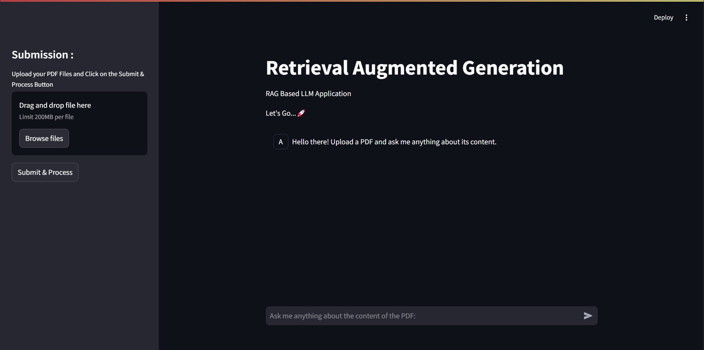

# 📚 RAG-Powered PDF Q&A System

 <!-- Replace with actual screenshot/GIF -->

A Retrieval-Augmented Generation (RAG) application for querying PDF documents using Streamlit and Hugging Face LLMs.

## 🌟 Features
- **PDF Document Processing**
- **Semantic Search**
- **LLM-Powered Answers**
- **Conversational Interface**
- **Persistent Storage**

## 🛠️ Tech Stack

**Frontend**  
- Streamlit

**Backend**  
- Huggingface API
- Huggingface Embeddings (BAAI/bge-small-en-v1.5 t)
- LLM (google/gemma-1.1-7b-it via HuggingfaceAPI)
- LlamaIndex  

**Deployment**  
```bash
http://localhost:8501
```


## 🚀 Quick Start

```bash
# Clone repo
git clone https://github.com/Alayasokan/Mini-Project.git
cd Mini-Project/

# Setup environment
python -m venv venv
source venv/bin/activate  # Windows: venv\Scripts\activate

# Install dependencies
pip install -r requirements.txt

# Add your Hugging Face token
 paste your API Token in config.py "HF_TOKEN=your_token_here"

# Or Terminal
Generate a Hugging Face API token, then paste it in the terminal after login. Ensure it has write access.

# Run the app
streamlit run app.py

```